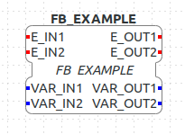

Dynamic INtelligent Architecture for Software and mOdular REconfiguration (DINASORE) is a platform...

## Architecture


* Communication with 4DIAC-IDE using tcp/ip with xml structured files.

## Usage

### Function Blocks Development

```xml
<?xml version="1.0" encoding="UTF-8" standalone="no"?>
<!DOCTYPE FBType>
<FBType Comment="" Name="FB_EXAMPLE">
  <InterfaceList>
    <EventInputs>
      <Event Comment="" Name="EVENT_INPUT_1" Type="Event"/>
      <Event Comment="" Name="EVENT_INPUT_2" Type="Event"/>
    </EventInputs>
    <EventOutputs>
      <Event Comment="" Name="EVENT_OUTPUT_1" Type="Event"/>
      <Event Comment="" Name="EVENT_OUTPUT_2" Type="Event"/>
    </EventOutputs>
    <InputVars>
      <VarDeclaration Comment="" Name="VARIABLE_INPUT_1" Type="INT"/>
      <VarDeclaration Comment="" Name="VARIABLE_INPUT_2" Type="INT"/>
    </InputVars>
    <OutputVars>
      <VarDeclaration Comment="" Name="VARIABLE_OUTPUT_1" Type="INT"/>
      <VarDeclaration Comment="" Name="VARIABLE_OUTPUT_2" Type="INT"/>
    </OutputVars>
  </InterfaceList>
</FBType>

```

 

```python
# This class contains the shared resources 
# between all the function blocks instances
class SharedResources:

    def __init__(self):
        self.shared_resource_attribute = 23
        
    def shared_method(self):
        print('this is a shared method')
        return self.shared_resource_attribute
    
# This class represents the function block    
class FB_EXAMPLE:
    # shared resources between all the instantiated objects from that class
    resources = SharedResources()

    # Method responsible to check what event operation has to run
    # Receives as method arguments the event name, the event value and all the variables values
    def schedule(self, event_input_name, event_input_value, VARIABLE_INPUT_1, VARIABLE_INPUT_2):
        # Initialize the output events
        EVENT_OUTPUT_1 = None
        EVENT_OUTPUT_2 = None
    
        # Initialize the output variables
        VARIABLE_OUTPUT_1 = 0
        VARIABLE_OUTPUT_2 = 0
        
        # Checks what events receive
        if event_input_name == 'EVENT_INPUT_1':
            VARIABLE_OUTPUT_1 = self.resources.shared_method()
            EVENT_OUTPUT_1 = event_input_value
            
        elif event_input_name == 'EVENT_INPUT_2':
            VARIABLE_OUTPUT_2 = self.intern_method(VARIABLE_INPUT_1, VARIABLE_INPUT_2)
            EVENT_OUTPUT_2 = event_input_value

        # Returns all the events values and all the variable values
        # The order most be the same like the xml events/variables order
        return [EVENT_OUTPUT_1, EVENT_OUTPUT_2, VARIABLE_OUTPUT_1, VARIABLE_OUTPUT_2]

    def intern_method(self, VARIABLE_INPUT_1, VARIABLE_INPUT_2):
        print('this is an intern method')
        return  VARIABLE_INPUT_1 + VARIABLE_INPUT_2
```

### Configuration Modeling (4DIAC)


## References


## Contributions
