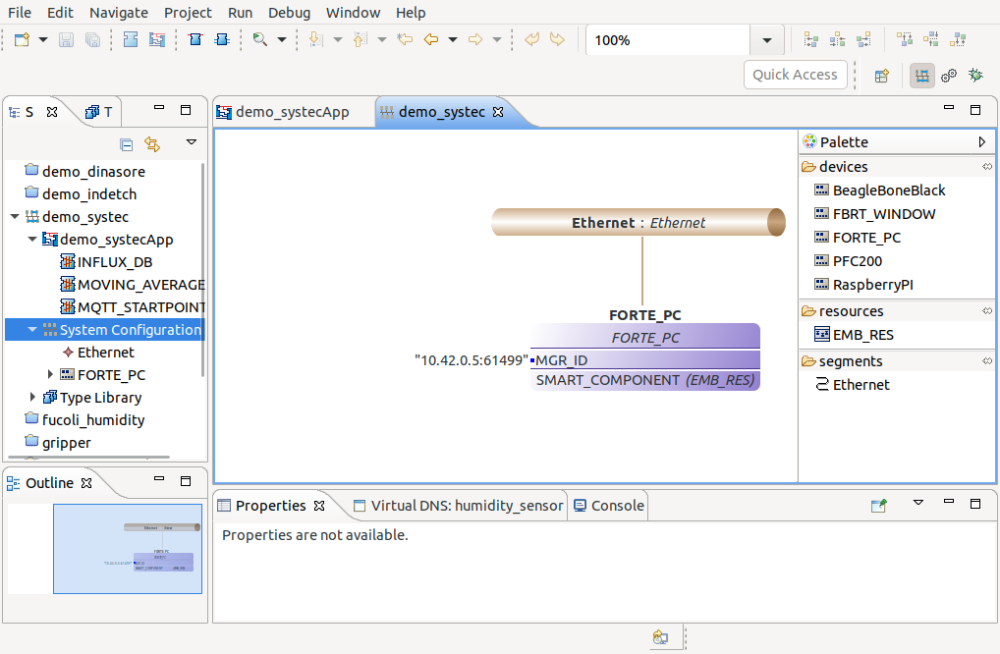
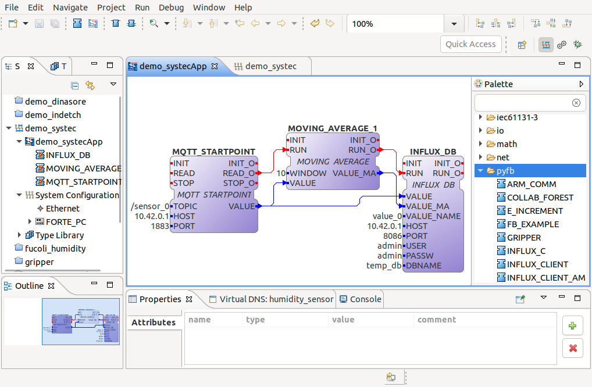
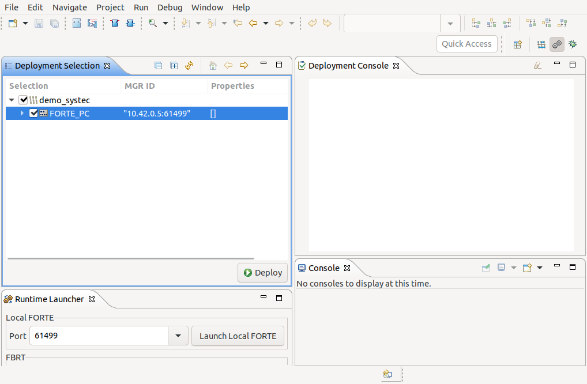

**D**ynamic **IN**telligent **A**rchitecture for **S**oftware and M**O**dular **RE**configuration - **DINASORE** - is a distributed platform that runs at the
fog computing level, enabling the pre-processing of data using algorithms, that are encapsulated inside modules (function blocks).

The principal advantage of this platform is the redistribution of the running modules across a distributed fog network. 
So the user can develop their own code, in Python, and them upload it to the different DINASORE nodes in the network.
To draw the system it's used the 4DIAC-IDE witch is according the IEC61499 standards. 

This version is targeted to the Industry4.0 applications, for that it was also used the UPC-UA protocol to allow the communication with the other industrial components.

## Features
- [x] Communication between the DINASORE and the 4DIAC-IDE 
- [x] Encapsulation of a function block inside the DINASORE
- [x] Execution of multiple function blocks inside the DINASORE
- [x] Distributed execution of a configuration across the network
- [x] Monitoring of all function blocks using the watch option at the 4DIAC-IDE
- [x] Remote stop of a configuration that is running
- [x] Docker integration
- [x] Opc-Ua integration
- [x] Configuration storage
- [ ] Parallelize the function blocks (processing, joblib) 
- [ ] Download function blocks from 4DIAC-IDE repository
- [ ] Edit the function blocks in the 4DIAC-IDE and automatically update the code in the nodes
- [ ] Test with complex variables (lists, arrays, methods (strings))

## Installation
In this section it is explained witch requirements are needed to use the DINASORE, and how to use it to develop complex distributed systems.

### Requirements
* [[Python 3.6/3.7](https://www.python.org/downloads/)] or [[Docker](https://docs.docker.com/toolbox/toolbox_install_windows/)] - component needed to run the DINASORE image;
* [[4DIAC-IDE](https://www.eclipse.org/4diac/en_dow.php)] - component needed to draw the graphic configuration, based in function blocks.

### Using Python 
If you want to install the DINASORE image using Python, you must use the following commands:
1. Clone the repository this from the github;
2. Move to the DINASORE folder and install the DINASORE requirements using pip;
3. (OPTIONAL) Run the unitary test to check if is everything ok (it could take a time (approximately 1 minute));
4. Run the project, where the flag -a corresponds to the ip address, the flag -p corresponds to the 4DIAC-IDE port, the flag -u to the OPC-UA port
and the flag -l to the logging level witch could be ERROR, WARN or INFO.

```bash
git clone https://github.com/SYSTEC-FoF-FEUP/dinasore-ua.git

cd dinasore-ua
pip install -r requirements.txt

python tests/__init__.py

# Default values: <ip_address>=localhost, <port_diac>=61499, <port_opc>=4840 and <log_level>=ERROR
python core/main.py -a <ip_address> -p <port_diac> -u <port_opc> -l <log_level>
```

### Using Docker
If you want to install the DINASORE image  using docker, you must use the following commands:
1. Using docker pull the DINASORE image from the docker repository;
2. Run the docker container, replacing the <absolute_path_host> by the absolute path to the project folder, the <ip_address> by the ip address, 
the <_port_diac> by the 4DIAC-IDE communication port, the <port_opc> by the OPC_UA communication port and the <log_level> by to the logging 
level witch could be ERROR, WARN or INFO.

```bash
docker pull systecfof/dinasore-ua:amd64-0.1

docker run --network="host" \
           --volume=/<absolute_path_host>/resources:/usr/src/dinasore-ua/resources \
           systecfof/dinasore-ua:amd64-0.1 -a <ip_address> -p <_port_diac> -u <port_opc> -l <log_level>

# (OPTIONAL) to rebuild the image, creating a new image
docker build -t dinasore-ua-new-image-name .
```

This image is to amd64 processors architectures, for arm architectures you must use another image. 

## Graphical Interface - 4DIAC-IDE
To draw the function block distributed architecture you need to use the 4DIAC-IDE.

#### Create the function blocks folder:
1. Create a new folder (e.g. python_fb) in the this 4DIAC path **.../4diac-ide/typelibrary/**;
2. Copy the function blocks files (.fbt), from the **.../resources/function_blocks/** folder to the new folder;
3. (OPTIONAL) If you have already start a new project you need also to put the function blocks files (.fbt) in the project folder **.../4diac-ide/workspace/(project_name)/(new_folder)** and reload the library.

#### Graphical Interface:
- System Perspective - perspective where you 1) draw your function block configuration and 2) construct your network map of devices;
- Deployment Perspective - perspective where you 1) upload the function blocks to each device (you can select witch device you want) and 2) export the configuration file.

**NOTE:** for more details about the 4DIAC-IDE check this [link](https://www.eclipse.org/4diac/en_help.php?helppage=html/4diacIDE/overview.html)

#### Draw the configuration:
1. Run the 4DIAC-IDE and create a new system (File->New->New System);
2. Now open in the left bar open the system configuration, after that drag and drop an Ethernet segment and a FORTE_PC device;
3. Then connect the device and the segment, and define the device IP address, port and change his name (e.g. SMART_COMPONENT);



4. Move to the application design perspective using the left bar;
5. Check if exists any folder name that you give it (e.g. python_fb) and drag and drop each function block;



6. Now you need to associate each function block to one device, for that right click inside each function block and select Map to...->FORTE_PC->SMART_COMPONENT (automatically each function block changes his color);
7. Change to the deploy perspective using the right corner gear icon;



8. Then select the devices that you want to reconfigure and finally click on the deploy button;
9. (OPTIONAL) If you want to export this configuration to a .txt file go to Run->Create FORTE boot-files...

#### Monitor your system:

* Reset the current configuration
* monitor the function blocks using watch
* monitor the function blocks using an opc-ua client

## Build new Function Blocks
In this section we gonna show how you develop a new function block and after that how you develop a new configuration and upload it to the network using the 4DIAC-IDE.
To create a function block you need to develop 2 different files a **Python file** (used to code the function block processing modules) and a **XML file** (used to define the function block interface). 

### Project Structure

* **communication** - files that allow the communication with the 4DIAC-IDE; 
* **core** - files that run the function blocks pipeline (configuration);
* **data_model** - files responsible to store the actual configuration and make the interface between the FB pipeline and the OPC-UA model;
* **opc_ua** - files that implement some high level methods based in OPC-UA; 
* **resources** - folder that stores all the resources in the project (YOU ONLY NEED TO USE THAT FOLDER);
  * **function_blocks** - folder where are stored the function blocks (Python + XML);
    * EMB_RES.* - function block used to start the pipeline;
    * SLEEP.* - function block used to run in loop the DEVICE.SENSOR and POINT.STARTPOINT function blocks;
    * TEST...* - function blocks used for the unitary tests. 
  * data_model.xml - file where is stored the current configuration;
  * error_list.log - file that stores all the execution errors.
* **tests** - unitary test used to validate each package in the project.

### Function Block Nomenclature
To develop a new function block first we need to define the interface attributes that the function block uses. 
That interface is composed by events and variables, both of them can be inputs or outputs. 
The difference between an event and a variable is that the event triggers the execution of a certain functionality.

Each function blocks has also a unique type that identifies it (FB type) (present in the 'FBType' tag), to organize a group of function blocks, it was created general categories.
You specify both of them inside the XML file. You must use also the FB type as name of the Python file (FB_TYPE_EXAMPLE.py) and the XML file (FB_TYPE_EXAMPLE.fbt)

The category of the function block is present in the 'FBType' tag in the 'OpcUa' attribute.
There are 4 different general categories of function blocks:
* **DEVICE.SENSOR** - general category used to represent a sensor (e.g. temperature, voltage);
* **SERVICE** - general category used to represent a processing module (e.g. moving average, normalization);
* **POINT.STARTPOINT** - general category used to represent a protocol that receives data (e.g mqtt, http);
* **POINT.ENDPOINT** - general category used to represent a protocol that sends data (e.g. mqtt, http).

#### Loop Function Blocks
The **DEVICE.SENSOR** and the **POINT.STARTPOINT** automatically execute in loop, because they need to get data continuously both from sensors or protocols. 
For that are used 2 default input events ('INIT' and 'READ') and 2 default output events ('INIT_O' and 'READ_O'), you only need to link connections in the 'READ_O' event because the others are trigger automatically by the DINASORE engine.

```xml
<FBType Name="FB_TYPE_EXAMPLE" OpcUa="POINT.STARTPOINT">
    <InterfaceList>
        <EventInputs>
            <Event Name="INIT" Type="Event"/>
            <Event Name="READ" Type="Event"/>
        </EventInputs>
        <EventOutputs>
            <Event Name="INIT_O" Type="Event"/>
            <Event Name="READ_O" Type="Event">
                <With Var="VAR_EXAMPLE"/>
            </Event>
        </EventOutputs>
        <InputVars>
            <VarDeclaration Name="CONST_EXAMPLE" Type="STRING" OpcUa="Constant"/>
        </InputVars>
        <OutputVars>
            <VarDeclaration Name="VAR_EXAMPLE" Type="REAL" OpcUa="Variable"/>
        </OutputVars>
    </InterfaceList>
</FBType>
```

To virtualize some variables, it is needed in the var declaration to specify the type of the 'OpcUa' attribute (OpcUa="Variable", OpcUa="Constant").
It's also important to add in the events tag the variables that are related with them (e.g. READ_O event produces data related with the VAR_EXAMPLE ('With Var' tag)).

#### Trigger Function Blocks
The **SERVICE** and the **POINT.ENDPOINT** general categories execute only when trigger by other function blocks. 
They use also 4 default events, but in this case the name of the READ/READ_O events are replaced by RUN/RUN_O.

```xml
<FBType Name="FB_TYPE_EXAMPLE" OpcUa="SERVICE">
    <InterfaceList>
        <EventInputs>
            <Event Name="INIT" Type="Event"/>
            <Event Name="RUN" Type="Event" OpcUa="Method">
                <With Var="VAR1_EXAMPLE"/>
            </Event>
        </EventInputs>
        <EventOutputs>
            <Event Name="INIT_O" Type="Event"/>
            <Event Name="RUN_O" Type="Event">
                <With Var="VAR2_EXAMPLE"/>
            </Event>
        </EventOutputs>
        <InputVars>
            <VarDeclaration Name="CONST_EXAMPLE" Type="INT" OpcUa="Constant.RUN"/>
            <VarDeclaration Name="VAR1_EXAMPLE" Type="REAL" OpcUa="Variable.RUN"/>
        </InputVars>
        <OutputVars>
            <VarDeclaration Name="VAR2_EXAMPLE" Type="REAL" OpcUa="Variable.RUN"/>
        </OutputVars>
    </InterfaceList>
</FBType>
```

In this case we have represented an OPC-UA method (check 'RUN' event attribute) for that it is need to use a OpcUa="Method" in the event tag. 
The variables used by each method must be reference the method, in the variables tag (e.g OpcUa="Constant.RUN").

For the **SERVICE** category you need to guarantee that the function block name (specified in the 4DIAC-IDE) is not the same as the function block type. 

#### Python Code
The second step to make a function block is encapsulate the code that you develop, inside a Python class.
1. First you must replace the class name (FB_NAME) by your new function block type.
2. Implement the state machine (inside schedule method) that checks what event was received and them execute the respective method.
3. Specify the returned attributes (output_events and output_variables) according to the order specified in the definition file.
4. Integrate the developed methods (if the method is shared between the function block instances use a static attribute in the class).

```python
class FB_TYPE_EXAMPLE:
    VAR2_EXAMPLE = 0

    def schedule(self, event_input_name, event_input_value, CONST_EXAMPLE, VAR1_EXAMPLE):
        # Checks what events receive
        if event_input_name == 'INIT':
            # Example of code
            self.VAR2_EXAMPLE = CONST_EXAMPLE
            # Returns all the events values and all the variable values
            # The order most be the same like the xml events/variables order
            return [event_input_value, None, self.VAR2_EXAMPLE]
            
        elif event_input_name == 'RUN':
            # Example of code
            self.VAR2_EXAMPLE += VAR1_EXAMPLE
            # Returns all the events values and all the variable values
            # The order most be the same like the xml events/variables order
            return [None, event_input_value, self.VAR2_EXAMPLE]
```

You can find some good examples of function blocks examples in these links: 
- MQTT Publisher [[XML](resources/function_blocks/MQTT_PUBLISHER.fbt)] [[Python](resources/function_blocks/MQTT_PUBLISHER.py)];
- MQTT Subscriber [[XML](resources/function_blocks/MQTT_SUBSCRIBER.fbt)] [[Python](resources/function_blocks/MQTT_SUBSCRIBER.py)];
- MQTT Publisher (2 Values) [[XML](resources/function_blocks/MQTT_PUBLISHER_2.fbt)] [[Python](resources/function_blocks/MQTT_PUBLISHER_2.py)];
- MQTT Subscriber (2 Values) [[XML](resources/function_blocks/MQTT_SUBSCRIBER_2.fbt)] [[Python](resources/function_blocks/MQTT_SUBSCRIBER_2.py)];
- Influx DB Writer (2 Values) [[XML](resources/function_blocks/INFLUX_DB_2.fbt)] [[Python](resources/function_blocks/INFLUX_DB_2.py)];
- Sensor Simulator [[XML](resources/function_blocks/SENSOR_SIMULATOR.fbt)] [[Python](resources/function_blocks/SENSOR_SIMULATOR.py)];
- Moving Average [[XML](resources/function_blocks/MOVING_AVERAGE.fbt)] [[Python](resources/function_blocks/MOVING_AVERAGE.py)].
